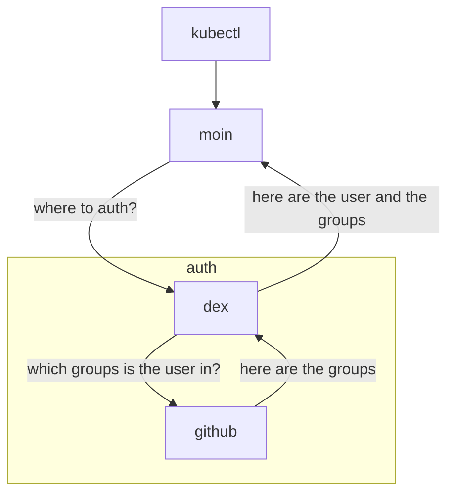
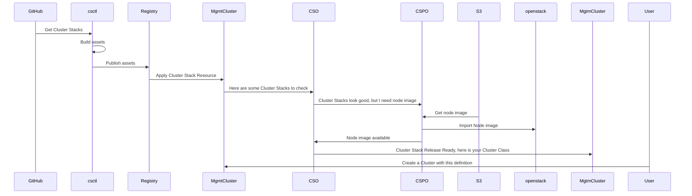

<!-- .slide: data-background="https://input.scs.community/uploads/47927b06-0a1b-4a45-a155-ec67e6c306ea.png" -->

<!-- Ease preperation with the template: https://github.com/SovereignCloudStack/minutes/tree/main/community-call/template.md -->

# Sovereign Cloud Stack
## One platform – standardized, built and operated by many.
## Community Call 2024-09-26

---

# Forum SCS-Standards

- First call among the founding members last Friday
    - short regular call every two weeks
- interims spokespersons have been appointed
- OSBA board resolution to proceed with the forum

----

### Members of the Forum

* Artcodix
* B1-Systems
* Cloud&Heat
* dataport
* dNation
* OSISM
* plusserver
* secunet
* stackxperts
* syself
* syseleven
* wavecon

---

### ProjectBoard

- Feedback received so far goes towards Proposal 1
- Idea: Document the process in an ADR (-> feedback via PRs and Comments)
- Publish also in our community documentation on docs.scs.community

---

# Team IaaS

We build the reference implementation of the IaaS parts of SCS 

Report by <a href="https://github.com/matofeder">@matofeder</a>

----

## Team IaaS

- Release of OSISM 8.0.1
    - Prometheus OpenStack exporter now disabled by default because of to many users reporting OOM issues
    - Lot of improvements and bugfixes in Rook
    - See release [notes](https://osism.tech/docs/release-notes/osism-8#801-20240924)

- Upcoming breaking change in R7.1 / OSISM 8.1
    - Deploy OpenSearch & Prometheus not on the control nodes by default
        - Due to IO issues
        - Put them on the manager node
        - Docs - how to deploy/migrate will be available

----

## Team IaaS

- Standards
    - Mandatory IaaS Services [#587](https://github.com/SovereignCloudStack/standards/pull/587)
        - Easy case: Provider offers both swift and S3: Endpoint published in the keystone service catalogue as `swift/object-store` (this is common practice today)
        - For S3 only (if we allow it): Need to find a way to publish the endpoint
            - Own entry (not `swift/object-store`) in keystone service catalogue?
            - Other standardized docs, e.g. Gaia-X Self-Description/Verifiable Credential
    - Decision: CSPs either use SWIFT+S3 and publish it via keystone OR they separately pass the information to the certification (machine-readable way)

----

## Team IaaS

- Standards
    - Mandating Network Auto-allocation Support in Provider Network [#572](https://github.com/SovereignCloudStack/standards/pull/572)
        - Automated setup of project network, subnet, and router connected to provider network with single API call
        - Are there any concerns regarding requiring this in the standard?
            - Reach out to CSPs to discuss whether standard requirements are an issue or not

---

# Team IAM & Security

Report by <a href="https://github.com/juanptm">@JuanPTM</a>

----

## Security

- Meeting on next steps regarding SBOM support to Minery

## Federation

- Discussion about [functional requirements](https://input.scs.community/scs-federation?both#) for Federation

---

# Team Container

----

# Team Container

---

## SIG Documentation

## [Artcodix Deployment Example online 🚀](https://docs.scs.community/docs/iaas/deployment-examples/artcodix/) 

## Join our next session on October 7th 🌭 
11AM CEST at https://conf.scs.koeln:8443/SCS-Tech

---

# SIG Standardization/Certification

Report by <a href="https://github.com/mbuechse">@garloff</a>

----

## SIG Standardization/Certification

- Roadmap for Standardization over the next months
- SCS-compatible IaaS v5 planned for November
- SCS-compatible KaaS v1 (!) planned for November
    - Important to have a meaningful KaaS v1
    - Ensure we avoid roadblocks
    - Testing framework with cluster creation plugins (beyond ClusterStacks)
    - Network policies

---

## govstack @ EOF

----

## Cloud Infrastructure Specifications published!

https://govstack.gitbook.io/
https://govstack.gitbook.io/cloud-infrastructure

----

## govstack: Next steps

* Joint press release
* SCS on govstack Marketplace
* Training with ITU (Djibouti)
* Make existing UNICC OpenStack (Canonical) SCS-compatible
* Deploy SCS Software @ UNICC for govstack sandbox hosting
* Have UNICC create SCS clouds for countries' digital infra

----

## Informatik-Festival 2024

* Manuela on stage in panel discussion
* Workshop w/ Dominik & Manuela
