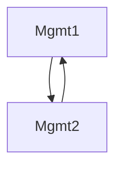

# 2024-05-23

## :family: Participants (github handles preferred)
- @paulphys
- @mxmxchere
- @DEiselt
- @artificial-intelligence
- @jschoone
- @frosty-geek
- @batistein
- @chess-knight
- @janiskemper
- @michal-gubricky
- @cah-hbaum
- @tonifinger
- @cah-patrickthiem
- @martindahlswe
- @martinmo

## :telephone: Community call and minutes transfer

* Who is reporting in the community call? : @jschoone
* Responsible for the minutes (writing and transfer to github): @mxmxchere

## :notebook: Agenda

### Deploy cluster-stacks management cluster using GitOps approach

Current state: https://github.com/SovereignCloudStack/moin-cluster-config/

Achieved:
- Cluster-API operator
- CAPI + CAPO with Cluster Topology Feature Gate
- CSO
- cert-manager
- namespace-triggered clusterstacks using kyverno
- cluster-validation (k8s-version as example) using kyverno
- capi-visualizer
- small README

Next:
- external-dns
- ingress controller + ingress
- issuer
- tenants
- rbac roles
- secrets

With the current state the repo is also a very nice solution to easily and quickly deploy a testing-cluster (either for dev-purposes or for CI runs). The upcoming tasks (mentioned above under "Next") would be solely for prod-environments (like the moin-cluster). It would be supernice to use the config for both (multiple) use-cases. Paul and I are investigating...

Progress tracking in: https://github.com/SovereignCloudStack/moin-cluster-config/issues/5

- feel free to try out

small debate whether "cluster-managing itself" is a good idea or not, flowchart above pictures an alternative approach, two management clusters management each other.

### Standardization
- GitOps tooling (https://github.com/SovereignCloudStack/issues/issues/420) (@cah-hbaum and/or @tonifinger)
    - Discussion about https://github.com/SovereignCloudStack/issues/issues/420#issuecomment-2124622507
- Opinions:
  - @mxmxchere: entirely user land and the decision to use GitOps should be up to the user, @jschoone agrees

### CAPO v0.10, API versions v1beta1 (@jschoone)
Clusterclass using v1beta1 merged (alpha-clusterstack, release assets yet to come)

### First version of Metal³ (@chess-knight, @jschoone)
https://github.com/SovereignCloudStack/cluster-stacks/pull/82

- dev-setup using virtual-machines possible (via redfish)
- real-world deployment will facilitate ironic

tests regarding CNIs will follow (kube-ovn looks promising, at least this will be also used in openstack)

Is it possible to use already existing ironic-deployments (instead of spinning up a dedicated one?)
  - not known yet, testing needed
  
### Cluster Stacks E2E tests (@michal-gubricky)

https://github.com/SovereignCloudStack/cluster-stacks/pull/53 - ready to be tested, testing is easy, just adding the correct label

What does this test test?
  - the openstack clusterstack alpha-1-29
  - cluster-stack is selectable
  - cluster deployment is tested, sonobuoy and scs-compliance tests are executed on the deployed cluster
  - HA is tested 3 controlplane nodes and 3 workers
  - readyness of all pods in kube-system namespace is checked via kubectl wait
  - repos code is delivered to the CSO via local-mode, no releases created
  - clusters are deleted afterwards

### Multi-Stage-Addons Demo (syself)
New feature in the cluster-stack-operator (CSO)
CSO is responsible for applying cluster-addons to workload clusters
Some addons (cilium) require multiple steps during upgrades
CSO, up to now, not possible to do this (single step only currently)
For cilium this works, but is not hickup-free

New approach: multiple stages configurable using a config file, read and processed by the CSO

Stages are helm-charts, executed consecutively
Cluster-API offers Runtime-SDK, which provides hooks in different stages of an upgrade. Before cluster-upgrade hook has been used to start upgrade.

Why has sveltos not been used to do this?
 - Possible, but code was chosen over configuration.

Why reinventing the wheel when sveltos might be able to do it already?
 - clusterstacks should do it all, instead of using multiple tools
 - sveltos expected to be difficult
 
Does the whole problem come from forcing k8s versions with addon versions?
  - bundling of k8s-versions with addon version is necessary to ensure a tested cluster-stack
  
Are rolebacks possible?
  -  currently not, just by hand
  -  make a newer clusterstack with old state "roleback-forward"
