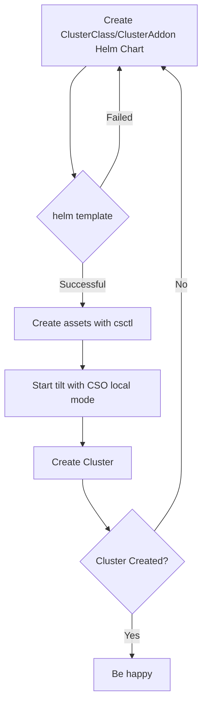

# SCS Community Hackathon #4

Page to register: https://events.scs.community/4hackathon/

## :globe_with_meridians: Where 

GONICUS GmbH
Möhnestraße 55
59755 Arnsberg

## :clock1030:  When

April 16th, 2024 - 9:30 - 19 CEST

## When _exactly_

* Arrival on the 15th in the evening is possible
* Informal gettogether on the evening of the 15th at the R-Cafe in Arnsberg 18:30 CEST https://r-cafe.de/ booked on SCS
* Hackathon is on the 16th - Opening Session at 9:30 CEST
* It is advised to stay for the evening on the 16th so that noone has to travel after a day of concentrated work

## Who is doing the heavy lifting (aka: the organizers) :muscle: :rocket: 

- Friederike Zelke (zelke@osb-alliance.com)
- Felix Kronlage-Dammers (fkr@osb-alliance.com)
- Jan Schoone (schoone@osb-alliance.com)
- Dominik Pataky (pataky@osb-alliance.com)
- Andreas Hoevelmann (hoevelmann@gonicus.de)
- Theresa Prag (prag@gonicus.de)

## :hotel: Hotel Situation :sleeping: 

* Right next to GONICUS there is an Ibis
* GONICUS has reserved a room contigent for both nights (15th -> 16th -> 17th)

## :bread: Food - mjam mjam mjam :yum: 

Snacks
- different types of chocolate bars
- gummy bears
- vegan snacks (Katjes)
- fruit basket
- ...

Lunch:
1. Chili sin carne (vegan)
   + rice
   + vegan pasta

2. Currywurst (with Baguette)
   + tomato-mozzarella skewers
  

## What is happening :100: 

* We will have three or four rooms for work sessions
* Idea is to upfront plan sessions that will happen there (https://input.scs.community/Hy0HqULMTGeeVIcy0vmBgA#Detailed-planning-of-work-sessions)

## Detailed planning of work sessions

Available Rooms:
- 3 rooms with 10 seats each
- 1 room with 12 seats
- 1 room with 2-3 standing desks

### ROOM 1 - Turning CiaB (Cloud-in-a-Box) from a dev-toolkit to an edge solution (@fkr)

https://review.opendev.org/c/openstack/publiccloud-sig/+/909387/8/specs/discoverability_service.rst

- I have one ciab
- I have two ciab
- I want to orchestrate two ciabs and inter-connect the two
- Maybe I even have three ciabs and want to have one in Stuttgart, one in Oldenburg and one in Cologne - but have one single-console to RULE them all
- Maybe this could be an entrance point to having a control plane to orchestrate multiple clusters.
- Who is interested in joining this session?
    - @fkr
    - @gtema

### ROOM 2 - Central API (@bitkeks)

https://input.scs.community/hackathon24-centralapi#

- General disussion around use-cases, abstraction width and hacking
- We will produce a working prototype
- TODO: Prepare gx-scs environment and deploy Kubernetes there, Crossplane
- Remote participants possible
- Who is interested in joining this session?
    - @bitkeks
    - @joshmue
    - @o-otte
    - @martinmo
- **Results from the prototype**: https://github.com/SovereignCloudStack/central-api/tree/feat/hackathon24/hackathon24

### ROOM 4 - Productive Keycloak and Identity-Federation (@scoopex)

**Ideas**

- As a SCS developer: [#526](https://github.com/SovereignCloudStack/standards/issues/526)
- As a CSP operator, I want to deploy and manage Keycloak in a clearly defined way, I just want to follow a clear documentation.
- As a CSP operator, I would like to set up and operate a stable and robust Keycloak setup 
    - settings which improve the reliability of the keycloak installation
    - settings optimized for the scaleout of hundeds/thousands of tenants
    - perform updates without service interruption
- As a CSP operator, I would like to manage the keycloak realm configuration lifecycle in an automated way 
    - create new realms with standardized configurations
    - onboard users
    - execute configuration changes for all tenants
    - delaunch realms
- As an SCS user, I would like to use my company's identity management to my SCS environments (using OIDC). 
    - Perform idendity brokering whith popular identity providers (i.e. Microsoft Entra/OIDC, ???)
        - [Entra](https://portal.azure.com/#view/Microsoft_AAD_IAM/ActiveDirectoryMenuBlade/~/Overview) : admin@msazureadtest256bit.onmicrosoft.com /  Iheeyaiyu2Hu
    - Allow customers to configure Identity Brokering in self-service
    - Write documentation for users
- Who is interested in joining this session?
    - @frosty-geek
    - @maliblatt
    - @scoopex

**Outcomes of the session:**

https://input.scs.community/C6OKMb4xQQuqnHC6axv08g#

### ROOM 3 - KaaS v2 with Cluster Stacks

https://input.scs.community/vEKDU57LScCHghuJlXg6lQ

- Working with Cluster Stacks to deploy managed workload clusters
- Find topics to work on in the Hackathon specific repository [cluster-stackathon](https://github.com/SovereignCloudStack/cluster-stackathon)
- How to build a Cluster Class and Cluster Stacks?

- KaaS v1 to v2 migration hands-on session
- Prepare a shared Management Cluster
- Who is interested in joining this session?
    - @jschoone
    - @bitkeks
    - @fkr
    - @jklippel
    - @mauhau
    - @martinmo

## Ideas for sessions

### Observability

- First idea for a topic, please ping me for ideas
- We have made substential progress in the observability of IaaS and also KaaS - let's do a deployment
- Who is interested in joining this session:
    - @scoopex

### Working with upstream projects

- How does the collaboration with upstream projects work? How do the communities differ? 
- Technical workflows
- Who is interested in joining this session:
    - @scoopex

- @artifical-intelligence: I would be interested/could present howto contribute to opendev/openstack e.g. "howto gerrit"

### VMware to SCS migration: What's needed, what's missing?

- Customer experience -- features?
- Operator experience
- Is a full *classic* IaaS alternative needed or a switch to Kubernetes wanted by the operator/customer/user?
- Who is interested in joining this session:
    - @belgeron
    - 

### Putting zuul into action

- Onboarding: How to integrate tests into our CI framework?
- Who is interested in joining this session:
    - ???

## Hackathon Recap

Last week our community gathered at [Gonicus](https://www.gonicus.de/en/) in Arnberg at our fourth community hackathon! Besides our intense hacking activities we had some attention from the outside: Maik Auẞendorf MdB of Bündnis 90/Grüne visited us to learn about SCS and digital sovereignty and independence: https://www.linkedin.com/feed/update/urn:li:activity:7185960147385470976. Another visitor was Torsten Koch, editor from Westfalenpost: https://www.wp.de/staedte/arnsberg/article242122804/Hackathon-bei-Gonicus-in-Neheim-Bis-die-Finger-bluten.html. 

But the community focus were five topics where great results were produced during the day: 

### Central API

The Central API shall offer an SCS-aligned interface to create resources in SCS and its components. The basic idea is to abstract some commonly needed objects over all layers, like users, virtual machines, networks, Kubernetes clusters, and offer one single endpoint to the customer.

In the Central API session we worked on a new prototype based on progressed ideas, concepts and implementation decisions. The result was a success. Could the previous Central API MVP "only" create resources on the IaaS layer, we were able to add connections to vanilla Kubernetes and the SCS Cluster Stacks API. In the end, a potential end-user (cloud provider customer) could request an IaaS VM and connect it, or could directly request a Kubernetes cluster which was then provisioned through Cluster Stacks.

### Status Page

Under development for the last few months, the Hackathon was effectively the first public announcement of our [Status Page project](https://github.com/SovereignCloudStack/status-page-web), our web frontend for the status API server used to track incidents and their impact.

Over the course of the day, we were able to provide the project with a usable container image based upon nginx and managed to clean up a number of TODOs we still had in our code, making the project finally ready for the official announcement during the following community talk.

### Productive Keycloak and Identity-Federation

A technical concept was developed on how identities and their authorizations can be standardized and fully managed in Keycloak for Keystone, Kubernetes, other CSP applications such as admin dashboards and also the cloud users' applications. 

We focused in particular on how identities from various external systems (e.g. the CSP's employee identities, the cloud user's corporate directory or the CSP's customer database) can be connected simultaneously (by SAML, OIDC, OAUTH) in a suitable manner using [Keycloak Identity Brokering](https://www.keycloak.org/docs/latest/server_admin/#_identity_broker).

As part of the conceptual work, the focus was on Keycloak itself and how external identities can be managed sensibly and efficiently for the various user groups involved. We chose an approach that largely avoids the need for complex processes to synchronize identities and their authorizations between external sources and Keycloak. [The results](https://input.scs.community/C6OKMb4xQQuqnHC6axv08g#) have since been discussed after the hackathon with the IAM team and individual stakeholders and can now be processed further.

### Discoverability

The overall topic of Discoverability of features and capabilities (without exposing capacity management in general) has been a topic that went inbetween SCS and the [OpenInfra Public-Cloud SIG](https://wiki.openstack.org/wiki/PublicCloudSIG) for quite some time. Since several of the involved actors were present at the hackathon we spontanously decided to dive into the topic. Artem (@gtema) wrote a [spec for such a discoverability service](https://review.opendev.org/c/openstack/publiccloud-sig/+/909387) a while ago and during the hackathon we managed to finalize it and discuss the open items. While this sounds very minimal the open items were open for a reason since discussig them is kinda like wading through quicksand - nevertheless, we were happy with the finalized results. The next day the result, which basiacally is that the discoverability service will be developed outside of the OpenInfra scope and then brought to the table (famous words: _Seeing is believing_ ;) was brought into the discussion with the Public-Cloud SIG at OpenInfra.

### KaaS v2 with Cluster Stacks

Cluster Stacks are the reference implementation of SCS KaaS. They are based on the Cluster API and benefit of its provider mechanisms to get deployed on arbitrary cloud infrastructure.
Before those can be used, Cluster Stacks follow a specific goal which is described in the Cluster Stack definition which points to a specific name. The user can expect the same goal of the Cluster Stack with the same name even on different providers, while the way could be a different one. For example if you want to make it possible to deploy clusters based on a specific Cluster Stack on Openstack and also on another provider like e.g. Metal³ or KubeVirt, the user can expect to have the same features. Of course only if the provider ist in scope of the Cluster Stack definition.
That means if we want to have Cluster Stack which makes it possible to offer a working LoadBalancer and CSI at the end, this will probably look different under the hood for Openstack and for KubeVirt. But abstraction layers in Kubernetes makes it possible to look almost the same for the user.
This was mostly part of the Hackathon in the session `KaaS v2 with Cluster Stacks`. To simplify the session, we described a simple Cluster Stack which has the requirement of running `Cilium` as a CNI, since the network is need to actually get the cluster to work.
We developed the first Cluster Stacks for the ClusterAPI Provider Docker, since this is a good provider for developing. After that worked we moved our learnings to the ClusterAPI Provider Openstack to enable us to deploy clusters on Openstack.
