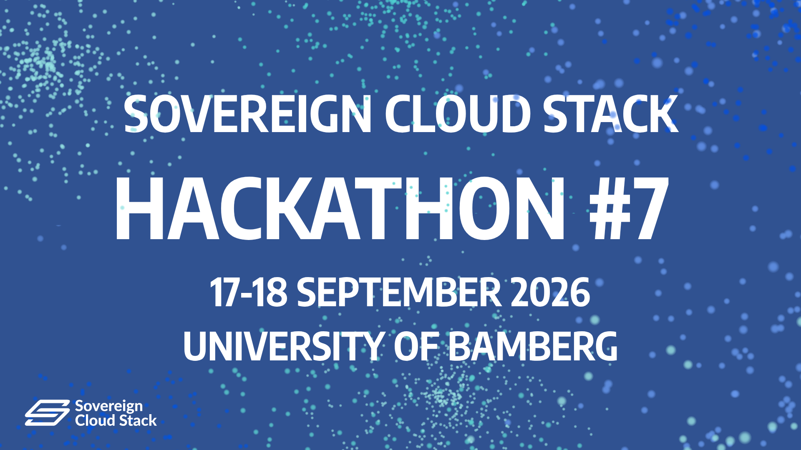

# SCS Hackathon #7 - 2026

## 💡 What

A Hackathon for the SCS Community. Working together and  having fun with like minded people.

This edition once again focuses primarily on KaaS, this time on the requirements for the next scope version KaaS v2 with a special focus on interoperability: How to make it easier for customers to move workloads between environments of different providers?

For example, one of our new members has introduced new challenges that we want to address together. The discussion has already started on [GitHub](https://github.com/SovereignCloudStack/standards/issues/1264).

## 📝 Results

### Group I: SCS KaaS - CRUD API for Clusters

- responsible person: @depressiveRobot, @schnatterer
- room: 05.018 "Cluster Crud"
- **↦ Goal:** Which standards do we need for KaaS Version 2?
- [Minutes](./Group-I-KaaS-CRUD-API-for-Clusters.md)

### Group II: Testing services for SCS PaaS

- responsible person: @toothstone, @gerbsen
- room: 05.132 "Testing Trash"
- **↦ Goal:** Which standards do we need for KaaS Version 2?
- [Minutes](./Group-II-Testing-services-for-SCS-PaaS.md)

### Group III: Upstream KaaS Conformance and Security

- responsible person: @garloff
- room: 01.006 "Utter Upstream"
- **↦ Goal:** What should be standardized according to D-Stack, DVC, etc? What do others standardize? What can we adopt? What do we have to standardize ourselves?
- [Minutes](./Group-III-Upstream-KaaS-Conformance-and-Security.md)

### Minutes

**Introduction round on 2026-09-17**
- expectations
  - set of ideas/drafts of new standards for KaaS v2 from a user's POV
  - be part of the emergence of standards
  - ensure portability of workloads between KaaS with standards
  - KaaS and security

**Joint evaluation and next steps on 2026-09-18**
- discussion about scs-0210-v2 and offering of last three minor versions
  - currently tradeoff between providing/upgrading to newest releases and give customers enough time to upgrade their workloads
  - subdiscussion: Should we determine how to make (node) updates? Predictable? Controlled by user?
    - How to test this automatically?
  - [ ] _Action item: continue discussion in SIG Std/Cert_
- storage (see Group II)
  - scs-0211 currently not suitable for (high-performance) databases
  - kinds of storage (through storage classes)
    - local high-performance 
    - RWO (replicated, currently default in deprecated scs-0211-v1)
    - RWX (replicated!?!)
    - Object (S3)
  - everyone needs storage, so it need to be offered
    - maximum capability: needs high customer interaction
    - standardized: easy for customers, less flexible
  - [ ] _Action item: create draft standard_
- discovery / self-description (see Group I)
  - improvement of discoverability makes it possible to mandate less
  - machine-readable self-description
    - allows overview over all providers
    - enhances comparability
  - things that a hard to standardize, but are necessary and therefore make sense to provide via self-description
    - networking/CNI
    - storage
    - ...
  - [ ] _Action item: create draft standard_
- load-balancer (see Group II)
  - Create a standard that mandates that a service with type LoadBalancer works, i.e. gets a (somehow reachable from outside of the cluster) IP address
    - Goal: User can automate a workflow to create Ingress/Gateway resources, fetch their externally reachable IP address, and put that into a DNS record to make their service available to end-users, verify Let's Encrypt cert request, ...
    - Caveats:
      - octavia (amphora) capo loadbalancers that use nip.io for the proxy protocol may end up with a .nip.io name instead of an IP in External IP (outside of cluster)?!
      - [PR 648](https://github.com/SovereignCloudStack/standards/pull/648) talks a lot about `externalTrafficPolicy: Local`?!
        - This is exactly about whether clients see the client IP address directly or only via proxy protocol ...
  - [ ] _Action item: create draft standard_
- security (see Group III)
  - [ ] _Action item: go through NIST list and decide if it should be incorporated into a standard_

## 💭 Topics

### SCS KaaS - CRUD API for Clusters

sponsor: @schnatterer

See https://github.com/SovereignCloudStack/standards/issues/1264

Moving from abstract concepts to hands-on POC. Here a some ideas for a hands-on approach to come closer to a concept (open for discussion!)
  1. Hands-on: provision clusters for each individual certified KaaS providers (e.g. using OpenTofu or the [existing compliance tests](https://github.com/SovereignCloudStack/standards/tree/main/Tests/kaas/plugin)) --> Get a feel for different APIs and identify similarities and differences (what can be standardized? What needs to be exposed by service discovery endpoint?)
  2. Implement a POC for [a service discovery endpoint](https://github.com/SovereignCloudStack/standards/issues/1264#issuecomment-5291453007) for each of the providers from 1. 
  3. Implement a demo service that reads service discovery endpoint and provisions clusters
  4. Alternatively or additionally we might want to get our hands on [central-api](https://github.com/SovereignCloudStack/central-api) (see also [this comment](https://github.com/SovereignCloudStack/standards/issues/1264#issuecomment-5440112505))
  5. Think about security (e.g. CVE handling) and how SCS can play a role with standards or in another way (@janiskemper)

### Testing services for SCS PaaS

sponsor: @depressiveRobot

See https://input.scs.community/2026-scs-sig-standardization#SCS-PaaS-services

The development of an SCS PaaS track also has an impact on the IaaS and KaaS standards. For example, services that are expected to become part of PaaS can be tested whether they can be deployed out of the box in an SCS IaaS/KaaS environment.

> For inspiration: something similar was discussed during Hackathon #6 in Fürth: [K8s features needed for OpenDesk](https://input.scs.community/KaaS-OpenDesk-as-ref-app) [name=Friedrich]
> For further inspiration: we already discussed to make openDesk a reference application for SCS (which would fit neatly into Deutschland-Stack) [#1167](https://github.com/SovereignCloudStack/standards/issues/1167) [name=Daniel]

### KaaS Conformance (NeoNephos)

sponsor: @garloff (Vasu)

> ok. ich hätte bei der sache einige punkte:
> 1. K8s conformance trumps SCS. man kann sowieso kein "K8s" im namen tragen, wenn man nicht CNCF conformance macht. 
> 2. K8s conformance wird bei CNCF verwalten und evidence ist dort verfügbar.
> 3. SCS sollte den focus auf multi-provider kompatibilität legen. wie sieht die API aus mit der ich einen HOMOGENEN cluster bestellen kann? wo storageclasses die gleichen namen für analoge qualität tragen. Und die Leaky abstractions einigermassen schliessen.
> 4. Man sollte die evidence continuierlich prüfen, wie beim testgrid. automatisiert. nicht einmal zur Verleihung des zertifikats.
> https://testgrid.kubernetes.io/conformance-gardener
> https://testgrid.kubernetes.io/gardener-extension-networking-cilium
> usw.
> 5. suonoboy von VMware/Broadcom?? Ernsthaft?? NL Haven+ leute haben imho ein viel tieferes verständnis der notwendigen kompatibilität für sich erarbeitet: https://havenplus.commonground.nl/docs/overview/ warum gibt es 100 verschiedene initiativen on top of k8s conformance? arbeitet ihr mit denen nicht zusammen? 
> 6. Am ende brauchst du einen technischen standard, der auch bei Auditoren wirkmächtig ist. Wie DISA STIG Kubernetes. Ich weiss gar nicht, ob du weisst, dass wir das beim Gardener voll automatisiert haben (der Auditor kriegt FIPS, DISA, BSI etc. Evdience aus dem Log automatisiert reported)
> 
> zu 2: https://gitlab.com/commonground/haven/haven/-/blob/main/haven/cli/pkg/cncf/validate.go?ref_type=heads#L66

### KaaS Security

sponsor: @garloff (Thomas Fricke (BSI))

https://github.com/thomasfricke/training-kubernetes-security/blob/main/Overview.ipynb

Im wesentlichen

https://www.bsi.bund.de/SharedDocs/Downloads/DE/BSI/Grundschutz/IT-GS-Kompendium_Einzel_PDFs_2022/07_SYS_IT_Systeme/SYS_1_6_Containerisierung_Edition_2022.pdf?__blob=publicationFile&v=3#download=1

und

https://www.bsi.bund.de/SharedDocs/Downloads/DE/BSI/Grundschutz/IT-GS-Kompendium_Einzel_PDFs_2022/06_APP_Anwendungen/APP_4_4_Kubernetes_Edition_2022.pdf?__blob=publicationFile&v=3

Zum Scannen empfehle ich Kubescape und Grype

## ☎️ Matrix

* https://matrix.to/#/#scs-hackathons:matrix.org
