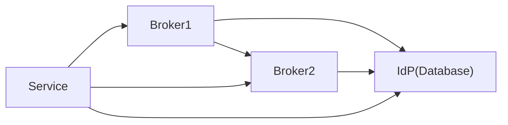
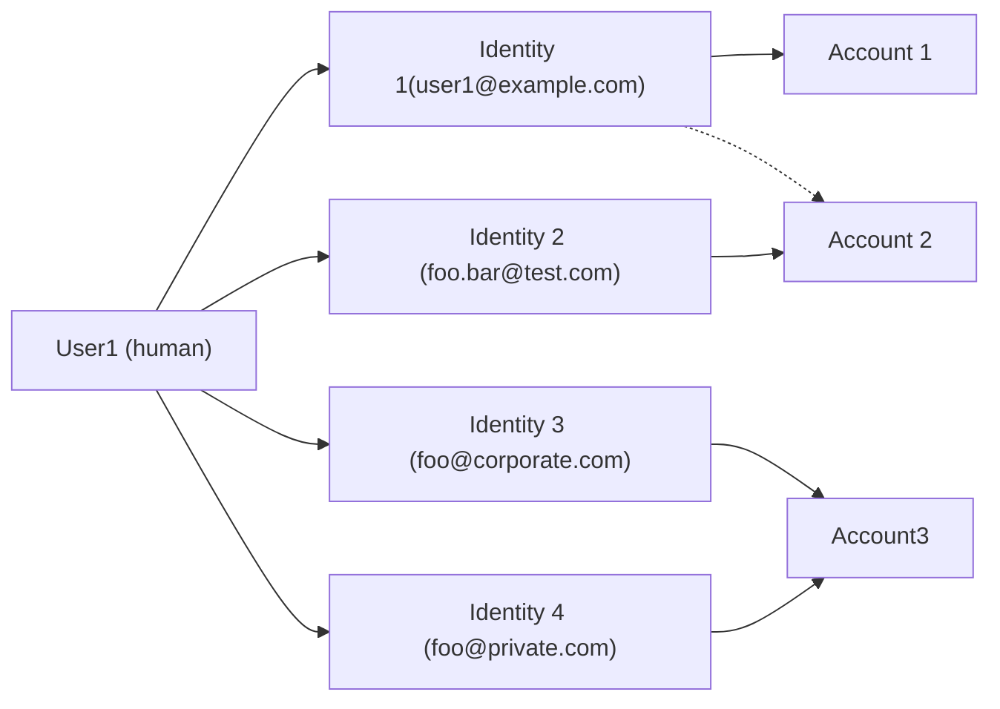

State of Identity federation for SCS ===

This article intends to describe state of the identity federation for SCS,
different architecture models with their benefits and limitations. 

# Definitions and terminology Personas: Defined in Design-Docs

SCS project (SCS OSBA project team) SCS developer (Someone developing
code/doc/integration/standards ... of the SCS reference impl) SCS Operator
(someone who runs an SCS cloud environment) SCS Integrator (Building a SCS
environment to be handed over to an operator) SCS Customer (Someone who
develops/runs workloads on SCS environments, typically a DevOps team) SCS
End-User (Someone who uses some application/workload running on top of SCS
environments)

* IdP = Identity provider: A system with a user (and group) database that
authenticates user identities and allows these authenticated users to prove to
the SP who they are 
* SP = Service Provider: A service (consuming the IDs from IdPs)
* ID Broker = A service that consumes Identities from IdPs (or), optionally
applies some policies/filters/changes and then provides them to an SP (or
another Broker) -- (a "caching proxy")

* Tenant = Isolated space owned, controlled and paid for by an SCS customer in
the service (SP) of an SCS Operator
* Environment = Subspace inside a tenant with some isolation from other
subspaces
* Tenant root account = Customer role who manages the Tenant (via self-service
as far as possible).
* Self-service by tenant root account
    * Managing Users and Groups locally in their tenant
    * Enabling Users and Groups from corporate IdPs for their tenant
    * Assigning authorizations (roles) inside their tenant to users and groups
    * Ability to create environments inside that tenant [...]

# Functional requirements 

Following are the functional requirements that need to be addressed. Those are
either gathered directly from CSPs and architects or logical consequence of the
direct requirements.

- social login. It must be possible to login into the cloud (console?, api?)
using certain social logins (i.e. GitHub, Google, etc).

- one login to access different tenants. It should be possible to reuse single
account to access different customer tenants (example is a re-seller or
consultant working with multiple customers).

- corporate IdP. It must be possible for the customer to plug in their customer
IdP(s) (e.g. LDAP or AD) in a self-management manner.

- Users must be not visible to other tenants (data privacy)

- local users in target system may be forbidden (opt-in). When using corporate
IdP explicitly it may be desired not to allow any other local accounts
bypassing the corporate identity or granting roles to users explicitly.

In the course of multiple discussions a set of user stories has been
identified. 

### Self Service

- As SCS Customer, I want that enabling my own IdP system for my own tenant can
be done via Self-Service, so I don't need to wait for someone approving this.

- As SCS Customer, I want to have the ability to create and delete OpenStack
projects, so I can reflect the structure of my various Dev Teams and Dev
Projects and segregate them (for billing, isolation, security, ...) [keystone]

- As SCS Customer, I want to have the ability to do the management of users in
an external IDM system (Identity Provider), that I have anyway and create a
mapping of attributes/claims there to the roles. (in practice should be done
with group membership)

- As a SCS Customer, I want to be able to define that users that match a
certain criteria in my IdP are mapped to a certain set of access rights
(generalization of group membership idea: mapping arbitrary attributes to
roles, filters, advanced mapping capabilities)

- As a SCS Operator I want to be able to provision a new tenant for a new
customer across the relevant services without interrupting services for other
customers/tenants [keystone]
   - Probably solved when we delegate Auth from Keystone to an Identity broker
   that holds all domains ("realms" in Keycloak lingo)

- As SCS Customer I would like to have the ability to have more than one
external IdP connected to my tenant. [May have to compromise on this one ...]

- As a SCS customer I want to come with a public well known IdP (google,
github, ...) and just sign up with that and start using a SCS cloud :) --
Sidenote: Requires significant effort for providers for fraud detection, T&C
acceptance ...
   - Default will be to be authenticed user without permissions until some
   tenant owner invites you to have more rights

### Privacy

- As a SCS Customer I don't want Customers to see my presence in the SCS
deployment (e.g. in login or federation dialogs). I also don't want this info
to trivially leak (e.g. by automated endpoint URL guessing).

- [Controversial]: As SCS Customer, I want to login and the system will
authenticate me without me entering an IdP name/URL/... so I don't need to
remember anything beyond my username and password (and potentially a second
factor if I opt for MFA). (This could be achieved by usernames that include the
domain/realm or brokers asking around ....)

### RBAC

- As SCS Customer, I want to have the ability to create users, assign them to
groups and assign roles (rights/authorizations) to the groups/users, so I can
control who can see (R) and who can modify (CUD) resources. [keystone]

- As a SCS Customer I want to have administrator rights for my resources to
define roles and map them to access privileges
    
- As Customer, I want to have the ability to have the same roles defined on
multiple SCS clouds. (Could be standardized or solved via central management.)
[Long-term]

- As a SCS Customer I want to extend the role mappings to my needs, across
technical boundaries of individual SCS components. (i.e. Keystone, Identity
Broker) [cross-component configuration / policies]

- As a SCS Customer I want to be sure that the roles and their mapping is
consistent across SCS components within one SCS environment (cloud). This may
require periodic reconciliation and reporting inconsistencies to the customer.
[higher-level authorization management] [long-term]

- As SCS developer, I want to avoid dealing with complex and hard to get right
keystone policies to define conceptually easy roles, so I avoid screwing up
(and potentially creating security issues if I do).

- As a SCS Operator I want to know how performance scales when customers create
a lot of custom roles [and policies] (e.g. to avoid DoS attacks). [keystone]
    
### SCS as IdP

- As SCS Customer, I want to use the identities that I created and manage in
one SCS cloud to control access to projects (in a tenant that I own) on another
SCS cloud, possibly with some mapping, so I don't need to do IDM multiple times
when using multiple SCS clouds. [Goal 2] Daisy-chaining SCS-tenants across
different SCS-deployments operated by different CSPs

- As a SCS Customer I want to be able federate out to two separated external IAM
sources: 1. for DevOps accounts, 2. Enduser accounts (IDM aaS)

### SSO

- As a DevOps-Team (SCS Customer) I want to use my SSI in order to spawn
kubernetes clusters on a set of SCS clouds. [Goal 4] [SSI = Self-Sovereign
Identities are a big unknown here, normal SSO = Single Sign-On should work.]

- As SCS project, I want to be sure we can (at least) connect to the Gaia-X IDM
world (i.e. SSI/DID style IDM), so we deliver on our "infrastructure for
Gaia-X" promise. [Goal 4]
    - Self-sovereign IDs are largely unknown to us -- we rely on the ability to
    bridge the gap with SSI-OIDC connectors to bridge this.

- [Out of Scope: As a DevOps-Team person (SCS Customer) and "holder of an SSI
identity" I want to be able to use SCS services (e.g. the status page
application). I.e. SCS shall be able to consume SSI. [Goal 4] ]

- As a SCS customer I want to access PaaS cloud services like Harbor, DBaaS
etc. with my own identity (+consistent login UX without passwords for each
service) => SingleLogIn into the "Cloud"

- As a SCS customer, I want to be able to orchestrate kubernetes clusters on
more than one SCS Operator's cloud with the same set of credentials in order to
achieve next level multi-cloud.
- As an SCS Developer, I want to instantly be able to login on my newly
deployed testbed with an existing IdP, e.g. GitHub, (or SSI)

- As an SCS Developer, I want to be able to login on the dev- and testing
hardware with an existing IdP, e.g. GitHub, (or SSI)

- As DevOps Team (SCS Customer) I want to use terraform (example for
Infra-as-Code tooling) across SCS clouds (i.e. with a federated account
provided in some external IAM (AzureAD/ADFS/freeIPA/whatever) As Customer, I
want to access both Web-UI and API/CLI with my federated identity.
    
### Non functional

- As an SCS Developer (architect), I want to understand the limitations of
existing keystone roles, so I understand what we need to develop to offer
Customers the ability to manage their projects and users.

- As SCS Customer I want to be sure that the separation of users, projects and
tenants is secure even in a federated scenario, so I can run workloads with
sensitive data on such clouds. (In extension, I may want this security to be
certified according to some security standard, e.g. BSI C5.)

- As a SCS Operator I want to restrict the customer/tenant admin from Elevation
of Privilege (leaving the scope of their domain), e.g. by creating new admin
account outside of his scope

- As a SCS Customer I want to have confidentiality and integrity of the
resources I have configured in my tenant

- As a SCS Operator I want to deliver scalable authentication performance and
know how performance scales when customers get added. [keycloak issue]

- As SCS developer (architect), I want to understand the options of real(TM) ID
Brokers that would indeed not just redirect requests but actually proxy for
other IdP systems in the auth workflow (as depicted by Jeff Chousterman), so we
may resolve the challenge of API/CLI access and avoid exposing the IdP.

- As a SCS architect, I need to have a clear understanding of the functionality
the IdP Broker needs to fulfill in order to fulfill the needs of the
container layer. [Goal 3]

- As a SCS Customer I want the SCS authN&authZ components to be reasonably
"deterministic" with regards to account naming collisions (e.g. using
namespacing)

# Architecture models

This chapter describes 2 different architecture designs how the Identity
Management may be modelled independently of the functional requirements given
above. After a long research it is clear that both models are being used by
current hyperscalers.

In the modern Identity management it is usual to also rely on the following
terminology:

- a physical person is called a "user"
- a "user" may have multiple "identities" (i.e. email addresses)
- every "identity" typically represents a single "account" which represents
access to the target system. It is not typical, but not imposssible to use
single identity for multiple accounts
- it is possible to link multiple identities within a single "account"

## Isolated tenant configuration (individual realm)

In this model every customer is configuring Identity Management for their
tenant exclusively as necessary. It is used by AWS (and by Okta and by
OpenStack and SCS thus far). Some of the logical consequences of this model
are:

- all user accounts (with identities) belong to the customer tenant (while it
is still possible to attach the same social login to accounts in multiple
tenants). Direct access or lookup of the user from other tenant is not easily
possible.
- platform login require tenant selection without easy possibility to login
using credentials and from there navigate to accessible tenants
    - tenant-specific URL for login
- dedicated Identity management UI/API must be available to the tenant
- security requirements (i.e. usage of MFA) are enforced on the tenant level

## Shared configuration

In this model users with their identities are kept separately and mapped into
system accounts. All tenants share global configuration with certain
capabilities for the tenant to plug in own IdP. Examples: GCP, Azure, artcodix

- users and identities are stored globally without direct relation to the
tenant
- every user is having direct personalized interface for management of their
identities
- it is possible for the tenant to connect additional IdP
- security requirements may be implemented globally and on the external IdP
side
- tenant may decide to enforce certain security rules (i.e. force MFA) on the
tenant level
- every tenant maps global user identities into the tenant (as accounts), local
identities (from external IdP) are also mapped
- tenant is not allowed to list global identities due to the data privacy.
Mapping may be implemented through invites or requests to join
- every global user identity may be mapped into multiple tenants
- relation of the user identity to the tenant by email domain is not desired
since it limits possibility to use single identity for access to multiple
tenants. Some clouds, however, force such relation based on the user's primary
identity.
- platform login may be implemented first requesting user's email address to
identify user and in the next step navigate to the corresponding external IdP
based on accessible tenant selection. 

# Federation related standards and protocols

## Authentication/Authorization

### OpenID

OpenIDConnect is a decentralized authentication protocol, it facilitates user
authentication through third-party identity providers while enabling users to
unify their digital identities.

### OAuth

OAuth is an authorization framework instead of traditional authentication.
Access to specific user data is delegated without exposing passwords, focusing
on delegated resource access.

### SAML (Security Assertion Markup Language)

An open standard based on XML that simplifies authentication across domains. It
enables single sign-on (SSO) providing seamless access to multiple applications
using one set of credentials. It is typically used in an enterprise
applications within a single company.

## SCIM

[System for cross-domain identity managent
(SCIM)](https://en.wikipedia.org/wiki/System_for_Cross-domain_Identity_Management)
is a standard created to address challenges of identity data synchronisation
between IdP and application. It is used to **provision/deprovision** users.
Currently majority of Identity and Cloud providers support it. In this protocol
IdP (in this case a client) pushes idenitity changes to the application
(server). A set of libraries exists to implement the protocol both for the IdP
and the applications.

**Note:** Currently Keycloak does not support natively neither data client nor
server mode. Extensions with limitations. Best candidate likely
https://github.com/mitodl/keycloak-scim

**Note:** SCIM is part of https://openid.net/wg/fastfed/ showing that it is
considered crucial part of the federation flow.

# Target application

## Arbitrary app with openidc

In order to further abstract different architecture models from target
applications specifics (OpenStack, Kubernetes, etc) an example of federation
support integration into an arbitrary application can be considered.

- an OpenIDConnect/SAML connection is registered in the target application
- remote groups can be mapped to local groups. Presence of such mapping may
trigger auto creation of local groups is those are not present
- local users created in the target application directly are not visible in a
connected IdP what may violate corporate regulations
- Permissions granted to the user (either directly or through group relation)
in the target application are not visible in the connected IdP
- typical approach is to grants of access to local groups while group
membership is controlled on the external IdP (with remote groups being mapped
to local groups)

### API keys

A common way of providing static access to the application when federated login
is not possible (i.e.. machine-to-machine access) is to create API keys. API
keys may be bound to the user entity that created them or not belong to any
user. When an API key is bound to the user created it it is usually desired to
revoke such key when user's access to the application is revoked. By nature
OpenIDConnect and SAML are authentication/authorization protocols and they do
not cover sharing of identity data between IdP and the target application. As
such when user's access is being revoked a separate flow of deprovisioning user
must be triggered.

## OpenStack

OpenStack does not differentiate users as humans eventually owning multiple
identities. Instead it only supports concept of accounts (called user) with
each account bound with single identity (email address) and a password defined.
Every user account belongs to a certain domain (tenant) and may be included
into user groups which also belong to the domain. User authorization is
enforced with predefined roles being granted to the user or the group on a
certain target (project or the whole domain).

There are 2 types of users in OpenStack:
- local (account managed by OpenStack)
- ephemeral or shadow (account managed by external IdP)

Ephemeral users are created upon successful authentication to OpenStack using
information coming from external IdP as configured by the appropriate mapping
rules. Attributes of such users are only updated during authentication due to
the nature of OpenIDConnect protocol that only deals with
authentication/authorization. Logical consequence of that is that user
information updated in the external IdP will be only updated in OpenStack on
the next login attempt. This causes changed group membership not being
respected immediately and API keys created by the user remaining active with no
real synchronisation procedure existing.

Local users, as the name suggest are owned by OpenStack and has password and
group membership information managed directly in OpenStack.

- `user_domain_name` field to establish to which domain the user account
belongs to
- `project_domain_name` field to get authorization to access resources inside
a(nother) domain

### Domain driver

It is possible to use a domain specific driver in Keystone allowing to get
information from the external IdP directly while still considering users as
local. In this case a domain is registered to be using certain driver and IdP
becomes source of truth for that domain. Typically local modifications in
Keystone would be prohibited, but it is possible to implement driver updating
data in the external IdP directly.

"Local users" stored in an external database (not keystone DB, except for
possibly a mapping.) Excludes other local users, all "local" users are then
managed this way.

### Federation support

Keystone does not natively support identity federation. Instead it is deployed
behind a helper proxy dealing with the used federation protocol (Shibboleth for
SAML2 and mod_auth_openidc for OAuth2/OIDC). This is unfortunate due to the
following limitations:

- admin-only management: registering IdP can be done only by system
administrator
- changes require application restart: typically adding new IdP require wider
configuration changes in the Apache requiring at the very least reload. Since
not every deployment tool supports reload often a disruptive restart is
unavoidable
- no domain scoping: all IdP are global and can not be bound for a specific
customer tenant as well as customer is not being able to register own IdP
without administrator support
- global mapping: only single
- absent support for back-channel communication: Keystone is not able to
implement certain additional protocols like back-channel initiated logout or
direct communication with IdP to poll user information
- absent support for IdP mode: Keystone is not able to serve as an IdP to
further integrate cloud applications

## Kubernetes

In Kubernetes concept of physical user or group entity [does not
exist](https://kubernetes.io/docs/reference/access-authn-authz/authentication/#users-in-kubernetes).
It supports [different authorization
mechanisms](https://kubernetes.io/docs/reference/access-authn-authz/authorization/).
In case of using RBAC authorization user is authenticating i.e. using
OpenIDConnect protocol and optional group membership may be extracted from the
configured claim. Afterwards user is able to perform operations allowed through
the `RoleBinding` or `ClusterRoleBinding` (either to the user or to the group).
There are few constraints of this model:

- no possibility to see user/group relation in Kubernetes
- no possibility to list available groups
- no possibility to list users
