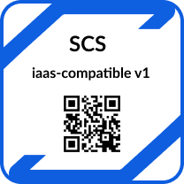

## 2023-08-24

### Participants (github handles preferred)

- @cah-hbaum
- @garloff
- @maxwolfs
- @fdobrovolny
- @matfechner
- @josephineSei
- @markus-hentsch
- @janiskemper
- @mbuechse
- @jschoone
- @anjastrunk
- @chess-knight
- @fkr

### Agenda
#### R5 standards (IaaS v4, Container v1)

- When?
    - Decouple a bit from release to prevent double crunch time for the SCS teams? Maybe end of year? (2023-12-01)
        - On the other hand, CSP teams might benefit from coupling?
        - But then the release could be construed a bigger obstacle than it actually is.
    - Decision: We decouple
        - Long-term plan: time-gap should become smaller in the future (long gap till Dec is due to avoiding too many parallel standard sets)
- What's in? (to be discussed 2023-09-07)
    - IaaS v4 (see also [issue #317](https://github.com/SovereignCloudStack/standards/issues/317))
        - Flavor names SCS-0100 [v3.1](https://github.com/SovereignCloudStack/standards/pull/332)
            - Split standard flavors SCS-0103 [issue #267](https://github.com/SovereignCloudStack/standards/issues/267), [PR #319](https://github.com/SovereignCloudStack/standards/pull/319)
        - Image Metadata SCS-0102: unchanged
            - Split standard image naming and URLS SCS-0104 [issue #326](https://github.com/SovereignCloudStack/standards/issues/326), [PR#314](https://github.com/SovereignCloudStack/standards/pull/314)
        - OpenStack Powered: Still no tests? [#300](https://github.com/SovereignCloudStack/standards/issues/300)
        - SSD flavors SCS-0110: Incorporated by SCS-0100-v3, Reference it?
        - Entropy SCS-0101: Testcases? Incorporate?
        - Storage Volume types: [issue #265](https://github.com/SovereignCloudStack/standards/issues/265): -> ?
        - Others: [Epic #285](https://github.com/SovereignCloudStack/standards/issues/285)
        - Networking? (Private nets, external net for Floating IPs, ...)
    - KaaS v1
        - K8s version recency SCS-0210: Needs updates [#334](https://github.com/SovereignCloudStack/standards/pull/334)?, tests?
        - Default storage properties SCS-0211, test [#289](https://github.com/SovereignCloudStack/standards/issues/289)
        - What else? (Anti-affinity, network policies, source IP ingress, metrics,  ...)
        - Others: Epic [#181](https://github.com/SovereignCloudStack/issues/issues/181)
- AI @jschoone: set up meeting between @jschoone, @garloff, @fkr (?), @mbuechse to 
        1. get acquainted with the epics [#285](https://github.com/SovereignCloudStack/standards/issues/285) and [#181](https://github.com/SovereignCloudStack/issues/issues/181) and do priorisation for the time until the end of the year AND/OR
        2. set up a process that gets CSPs involved

#### Process challenge

- How to get more CSP involvement?
- Primary benefitors of standardization are users (our CSP's customers) -- how to best get their perspective? 

#### Kick-off Badge/Certification Generator

- is there an issue with the sketch that we created on [2023-07-04](https://input.scs.community/2023-scs-sig-standardization?both#Designing-a-tamper-proof-badge)
    - [Sketches](https://www.figma.com/file/LgDS2uLib62mZYbuCGOR5Z/SCS-Playground?type=design&node-id=1151%3A16201&mode=design&t=LsZf9A9GGNFMZsP6-1)
    - 
    - AI @mbuechse: create stub issue for this
    - Issue will be assigned to C&H
    - Alignment with Alex

#### Standardization process

- progress with [Better document certification development/election process #343](https://github.com/SovereignCloudStack/issues/issues/343)
    - please check out [PR 329](https://github.com/SovereignCloudStack/standards/pull/329) and read [the extended MD file](https://github.com/SovereignCloudStack/standards/blob/extend_scs-0003/Standards/scs-0003-v1-sovereign-cloud-standards-yaml.md)
    - changes:
        - added lots of context in the introduction
        - introduced the distinction between "certificate" and "certificate type"
        - improved misleading wording in the motivation
        - rectified incorrect section levels
        - added process description (governance)
    - question by @maxwolfs: can we unify KaaS vs CaaS?
        - strictly speaking, CaaS is not the same thing as KaaS (cf. Fargate vs. EKS)
        - suggestion by @garloff: if we want to avoid referencing Kubernetes, we could speak of the "Container layer" just as we speak of "Team Container"
        - decision: keep KaaS
    - question by @mbuechse regarding `depends_on` (or `prerequisite` as @mbuechse would call it)
        - Shouldn't we require a valid certificate to be presented for the prerequisite?
        - Otherwise we could also run the tests for the prerequisite, which would be
            - *wasteful*, because they have to have run already for the former certificate, and 
            - *incomplete*, because some properties cannot be tested automatically, so they are part of the prereq but cannot be verified by the script
        - Suggestion: C&H works on a concept/decision record (related to #239?)
