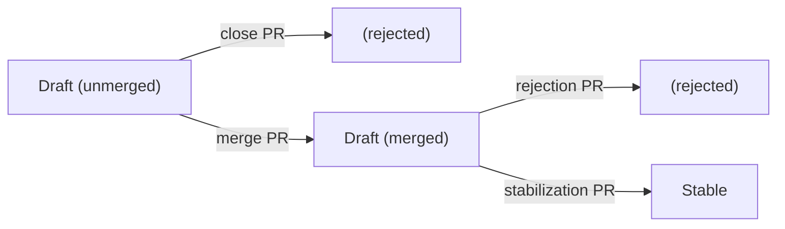

## 2024-09-19

### Participants (github handles preferred)

- @markus-hentsch
- @jospehineSei
- @mbuechse
- @garloff
- @kgube
- @fkr
- @gtema

### Housekeeping

#### Designate people for chores

- minute taking: @mbuechse
- minutes transfer: @mbuechse
- community call: @mbuechse

#### Check AIs from last time

- _AI @bitkeks: work on standard regarding pentesting_
    - ongoing
- _AI @mbuechse: switch to weekly with (many) exceptions_
    - done: [calendar/#313](https://github.com/SovereignCloudStack/calendar/pull/313)
- _AI @mbuechse: doodle the workshop date, e.g., two blocks of 90 minutes_
    - open
- _AI @mbuechse: write issue to get S3 requirement into KaaS certificate scope_
    - done: [standards/#727](https://github.com/SovereignCloudStack/standards/issues/727)

### Agenda

#### Audits for the standard on Availability Zones

sponsor: @josephineSei

- The standard on Availability Zones would require audits (someone has to be physically present and verify that fire zones exist - and some other physical requirements are met)
- This is briefly described in the [implementation and testing notes](https://github.com/SovereignCloudStack/standards/pull/640)
- Questions:
    - do we need a better detailed description on the audit?
    - what would be the timeframe of such audits?
    - How can we integrate possible results?
        - Maybe if only one AZ exists (this is automatically testable), this is automatically a success, and when there are more AZs the audit is needed and may be integrated?
- Discussion:
    - we should rely on self-description
        - Not just one check-mark, but a description of the physical setup that is reviewed by us
    - or refer to other certificates / audit reports (e.g. some ISO certification)?
    - at the same time, we may reserve the right to check at any time whether the description is correct
- Decision:
    - describe what kind of documentation we expect from the CSP; the audit then consists in us reading the documentation (@josephineSei)
    - _AI @mbuechse: enhance scs-0004-v1_ (regarding checks on premise)

#### Proposal and draft states for standards

sponsor: @markus-hentsch

- according to the [officially documented process](https://github.com/SovereignCloudStack/standards/blob/main/Standards/scs-0001-v1-sovereign-cloud-standards.md#process) for SCS standards, in the proposal phase:
    - "the status MUST be set to Proposal" in the beginning
    - at the end "the pull request can be merged and henceforth the document is an official SCS document in Draft state"
- there is no mention when and how the standard document transitions from "Proposal" to "Draft"
    - the instructions seem to imply that this transition happens solely on the branch *before* the very first PR is even accepted
- from a contributor point of view, the process is not straightforward: the proposal-to-draft transition step seems unclear; the draft merge later already represents an approval step
- suggestion: get rid of "Proposal" state, only differentiate between unmerged draft (initial proposal state) and merged draft (after discussion and approval):

Decision:

- state `Proposal` doesn't seem to add a lot of value, can be dropped
- find a way to nudge people into presenting their proposed ADR early on: drafts should be iterated on, and the first draft MAY be a "stub"
- we can do the edit in place
- _AI @markus-hentsch: create PR to remove Proposal state_
